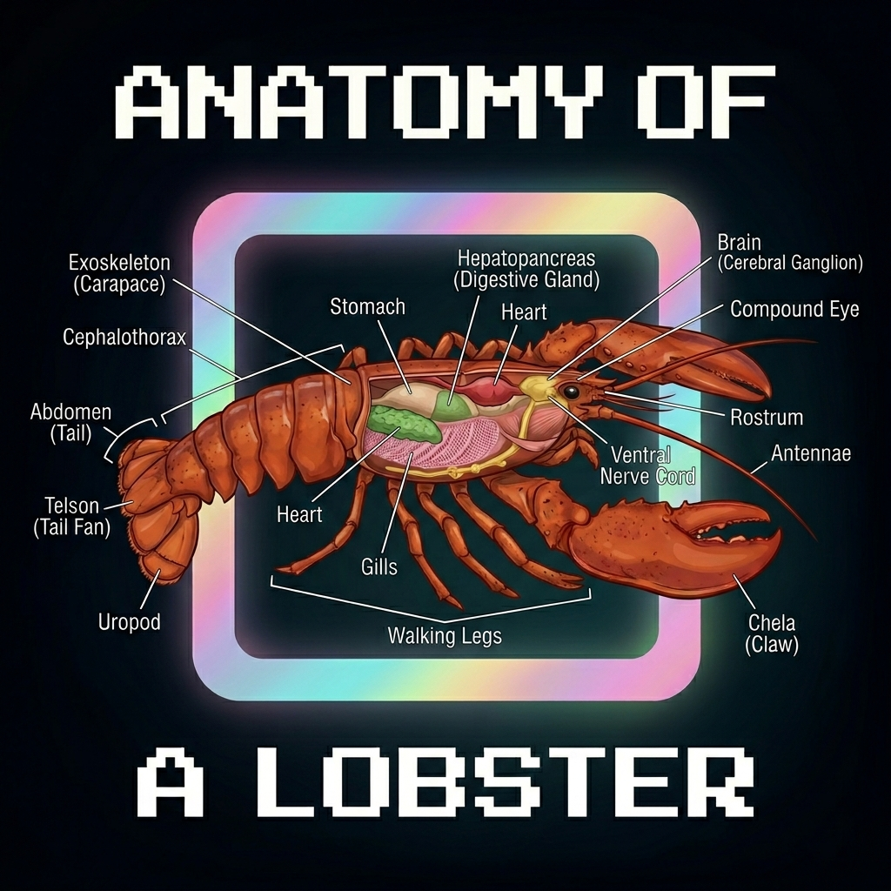

<!-- _class: center -->



By Sam Holmes

---

## Agenda

1. 🔧 **Under the Hood** — Architecture, gateway, agent runtime
2. 🧠 **Orchestration & Agentic Patterns** — Multi-agent, sub-agents, cron
3. 🛠️ **Building & Extending** — Skills, workspaces, tools
4. 💾 **Memory & Advanced Patterns** — Memory systems, hooks, nodes

<br>

> _20 minutes · hands-on architecture tour_

---

## What this audience asked for (from RSVP data)

- How OpenClaw works **under the hood**
- **Sub-agent orchestration** patterns that actually work
- How to build **independent, extensible agents**
- How to improve **memory + capability** over time

<br>

> _This deck is organized around those four asks._

---

<!-- _footer: "" -->

# 🔧 Under the Hood

<br>

<div class="section-label">Section 1 of 4</div>

---

## Question → Answer (Section 1)

**Q:** “How does it actually work under the hood?”

**A:** We’ll map the core path end-to-end:
- Gateway and channel routing
- Session/runtime boundaries
- Workspace contract and tool execution model

---

## Assumptions for this talk

You already know OpenClaw basics. So we’ll skip setup and focus on internals.

- ✅ You’ve installed and run it before
- ✅ You understand channels + agent replies
- ✅ You want deeper architecture and patterns
- ✅ Post-break audience is self-selected builders, so we’ll go practical and deep

<br>

**Today’s focus:**
1. How routing + runtime actually work
2. How to orchestrate sub-agents safely
3. How to extend with skills and memory patterns

---

## Architecture

<div class="diagram">

```
  📱 Chat Apps          🌐 Gateway            🤖 Agent Runtime
  ─────────────        ───────────            ─────────────────
  Telegram    ─┐                              ┌─ Workspace
  WhatsApp    ─┤──▶  WebSocket  ──▶  LLM  ──▶├─ Tools
  Discord     ─┤     Sessions                 ├─ Skills
  iMessage    ─┤     Routing                  └─ Memory
  Signal      ─┘     Channels
```

</div>

One gateway. Many channels. One agent brain.

---

## The Gateway

**WebSocket-based** message broker + session manager

- **Channels**: Telegram, Discord, WhatsApp, iMessage, Signal, Slack, Email...
- **Sessions**: per-user context, auth profiles, history
- **Routing**: deterministic binding rules → right message to right agent
- **Heartbeats**: scheduled pings to keep agents proactive

```json
{
  "channels": {
    "telegram": { "token": "...", "agentId": "main" },
    "discord":  { "token": "...", "agentId": "main" }
  }
}
```

---

## Agent Runtime

**The brain** — everything your agent knows and can do

```
~/.openclaw/workspace/
  ├── AGENTS.md     ← operating instructions
  ├── SOUL.md       ← persona & personality
  ├── USER.md       ← who you're helping
  ├── TOOLS.md      ← local env notes
  ├── MEMORY.md     ← long-term memory
  └── memory/       ← daily logs
      └── 2026-02-26.md
```

> _Files are the interface. Readable, editable, version-controlled._

---

<!-- _footer: "" -->

# 🧠 Orchestration & Agentic Patterns

<br>

<div class="section-label">Section 2 of 4</div>

---

## Question → Answer (Section 2)

**Q:** “How does sub-agent orchestration work in practice?”

**A:** We’ll cover the concrete mechanics:
- Deterministic routing + bindings
- `sessions_spawn` isolation model
- Parallel execution with safe result return

---

## Multi-Agent Routing

One gateway → **many agents**, each isolated

- Each agent has its own workspace, session history, auth profile
- Route by channel, user, guild, or custom rule
- Agents can have different models, personas, capabilities

```json
{
  "agents": {
    "main":   { "workspace": "~/.openclaw/workspace" },
    "devbot": { "workspace": "~/.openclaw/devbot" },
    "edgar":  { "workspace": "~/.openclaw/edgar" }
  }
}
```

---

## Bindings: Deterministic Routing

**How a message finds its agent**

```
Incoming message
      │
      ▼
  Peer match?  ──yes──▶  peer agent
      │ no
      ▼
  Guild match? ──yes──▶  guild agent
      │ no
      ▼
  Account match? ─yes──▶ account agent
      │ no
      ▼
  Channel default ──────▶ fallback agent
```

Predictable. Inspectable. No magic.

---

## Sub-Agent Spawning

**Parallel work, isolated context**

```
Main agent
    │
    ├──▶ subagent: "research X"     ─┐
    ├──▶ subagent: "write Y"         ├── run in parallel
    └──▶ subagent: "deploy Z"       ─┘
              │
              └──▶ auto-announce on completion
```

- `sessions_spawn` creates isolated child session
- Sub-agents get their own context window
- Results push back automatically — no polling

---

## Cron & Heartbeats

**Proactive agents that don't wait to be asked**

- **Heartbeats**: periodic pings → check email, calendar, alerts
- **Cron**: precise schedules → "every Monday 9am, send standup"
- **Background work**: commits, reports, monitoring while you sleep

```json
{
  "cron": [
    { "schedule": "0 9 * * 1", "prompt": "Send weekly standup", "channel": "telegram" },
    { "schedule": "*/30 * * * *", "prompt": "HEARTBEAT_MD", "model": "haiku" }
  ]
}
```

---

<!-- _footer: "" -->

# 🛠️ Building & Extending

<br>

<div class="section-label">Section 3 of 4</div>

---

## Question → Answer (Section 3)

**Q:** “How do I build independent agents I can replicate?”

**A:** We’ll break it down into a reusable blueprint:
- Workspace contract
- Bindings + model profile
- Skills + safety boundaries

---

## Skills

**Packaged capabilities** — drop in, wire up, use immediately

```
~/.openclaw/workspace/skills/
  └── weather/
      ├── SKILL.md      ← instructions for the agent
      ├── get-weather.sh
      └── parse.py
```

- Install from **ClawHub**: `clawhub install weather`
- Or write your own — it's just a directory + markdown
- Agent reads `SKILL.md` and knows how to use it

> _Skills = tools + docs bundled together_

---

## Agent Workspace Contract

**The files that define an agent**

| File | Purpose |
|------|---------|
| `AGENTS.md` | How to behave, what rules to follow |
| `SOUL.md` | Persona, tone, personality |
| `USER.md` | Who you're talking to |
| `TOOLS.md` | Local env: cameras, SSH, voice prefs |
| `MEMORY.md` | Long-term curated memory |

> _Change the files → change the agent. No redeployment needed._

---

## Independent Agent Blueprint (copy this)

| Component | What to define |
|---|---|
| Workspace | Dedicated folder for each agent (`~/.openclaw/<agent-name>/`) |
| Identity files | `AGENTS.md`, `SOUL.md`, `USER.md`, `TOOLS.md`, `MEMORY.md` |
| Routing | Channel/user/guild bindings in gateway config |
| Model profile | Default model + optional escalation strategy |
| Skills | Minimal starter pack (1-3 skills) tied to mission |
| Boundaries | Tool allowlists, approval rules, sensitive-action gates |
| Ops loop | Heartbeat checklist + cron for proactive tasks |

> _If you can define these seven, you can replicate agents reliably._

---

## The Tool System

**What agents can actually do**

```
Built-in tools
  read / write / edit / exec    ← filesystem & shell
  browser                       ← full web automation
  canvas                        ← visual surfaces
  nodes                         ← paired mobile devices
  message                       ← send to channels
  image / tts                   ← media generation
  web_fetch                     ← lightweight web access

+ Skill tools (custom scripts via SKILL.md)
```

---

## Multi-Agent Setup in Practice

**One gateway, many personalities**

```
openclaw.json
  ├── agent: "main"   → Claudine 🌸  (personal assistant)
  ├── agent: "edgar"  → Edgar 🤖     (dev/ops agent)
  └── agent: "devbot" → DevBot 🔧    (discord community bot)

Each has:
  • own workspace & memory
  • own model config
  • own channel bindings
  • own skill set
```

---

<!-- _footer: "" -->

# 💾 Memory & Advanced Patterns

<br>

<div class="section-label">Section 4 of 4</div>

---

## Question → Answer (Section 4)

**Q:** “How are people enhancing memory and capability in real deployments?”

**A:** We’ll walk through practical patterns:
- Multi-contact and group memory organization
- Distillation from daily logs to long-term memory
- Retrieval patterns that keep context focused

---

## Memory Pattern: Multi-Contact + Group Context

**How agents remember cleanly across people and channels**

```
Short-term (session)                 Long-term (structured files)
─────────────────────                ─────────────────────────────
Context window                       MEMORY.md
  └── recent turn state                └── curated durable facts

Per-contact memory                   Per-group memory
memory/contacts/<id>.md              memory/groups/<id>.md
  └── preferences, history             └── shared context, norms

Daily logs                           Retrieval layer
memory/YYYY-MM-DD.md                 memory_search("topic")
  └── raw events                       memory_get("preference")
```

- Organize memory by **contact + group**, not one giant file
- Distill daily logs into durable memory during heartbeat passes
- Keep memory readable/editable so behavior stays auditable

---

## Context Management

**Keeping the agent sharp over long sessions**

- **Compaction**: summarize older context, preserve key facts
- **Session pruning**: drop irrelevant history, keep signal
- **Context window budget**: models vary — manage proactively

```
Strategies:
  ✓ Load only relevant memory files per session type
  ✓ Use haiku for lightweight tasks (10x cheaper)
  ✓ Sub-agents for isolated work → don't bloat main context
  ✓ Heartbeat model: haiku | main chat: sonnet | deep work: opus
```

---

## Advanced Patterns

**The full surface area**

- 📡 **Webhooks & hooks** — trigger agents from external events
- 📱 **Mobile nodes** — iOS/Android paired devices (camera, screen, location)
- 🖼️ **Canvas surfaces** — agent-rendered UI overlays
- 🌐 **Browser automation** — Playwright-powered web control
- 🔁 **Agent-to-agent** — agents spawning agents, async pipelines

```bash
# Example: agent triggered by GitHub webhook
openclaw hook register --event push --agent devbot --channel discord
```

---

<!-- _class: center -->

# Get Your Claws Ready 🦞

<br>

| | |
|--|--|
| 🌐 **Website** | openclaw.ai |
| 📖 **Docs** | docs.openclaw.ai |
| 🐙 **GitHub** | github.com/openclaw/openclaw |
| 👾 **Community** | sdx.community |

<br>

**Builder CTA:** Start with one agent, one skill, and one heartbeat loop.

_Questions? Ask the lobster._
